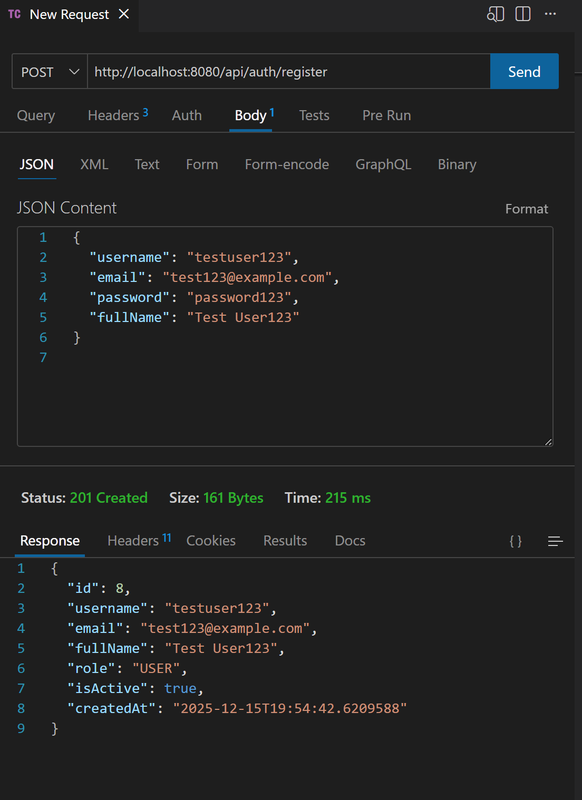
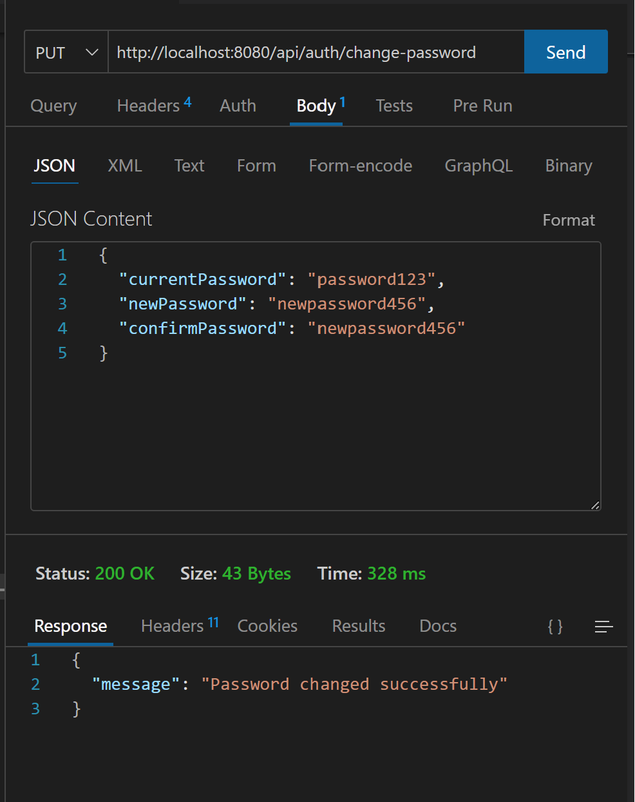
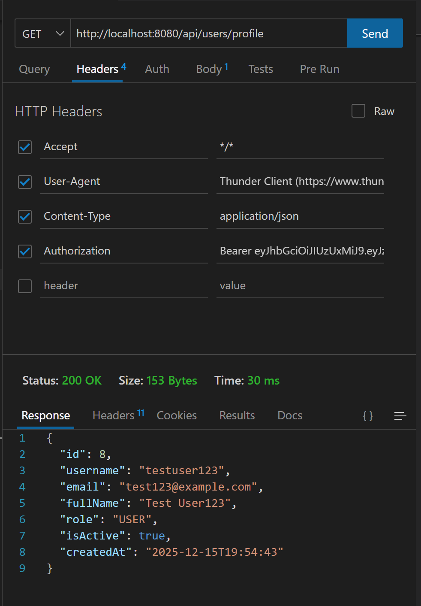
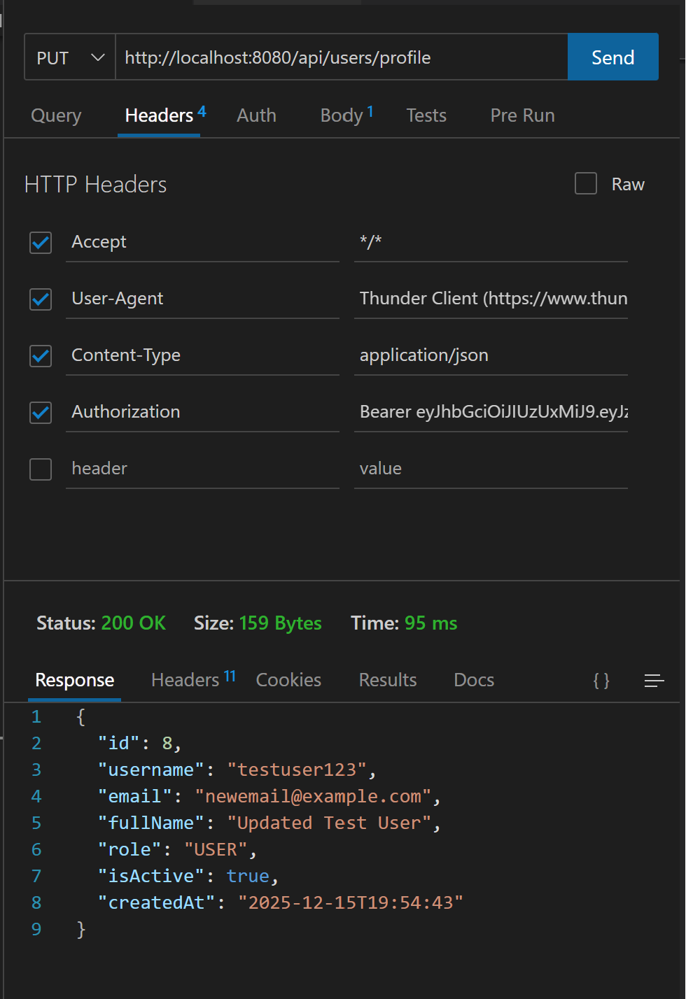
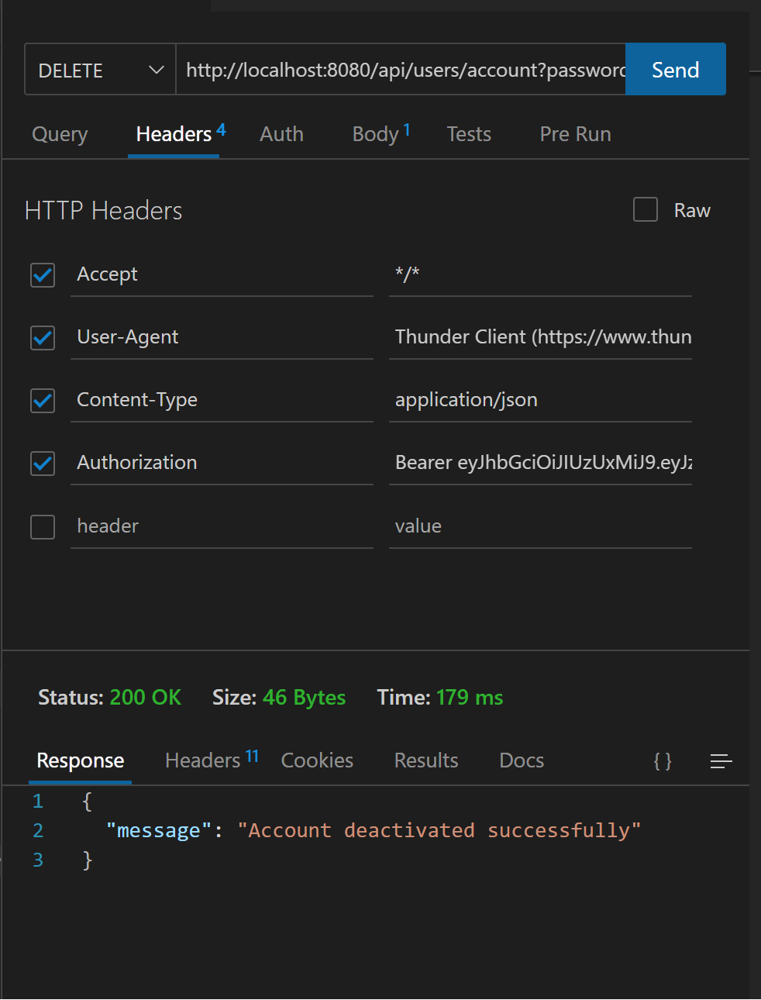
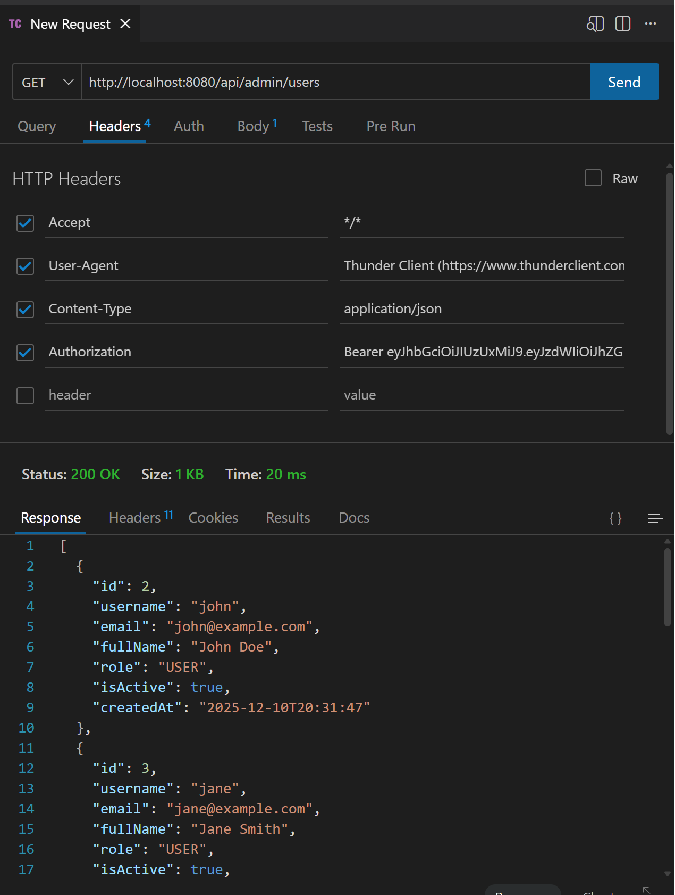
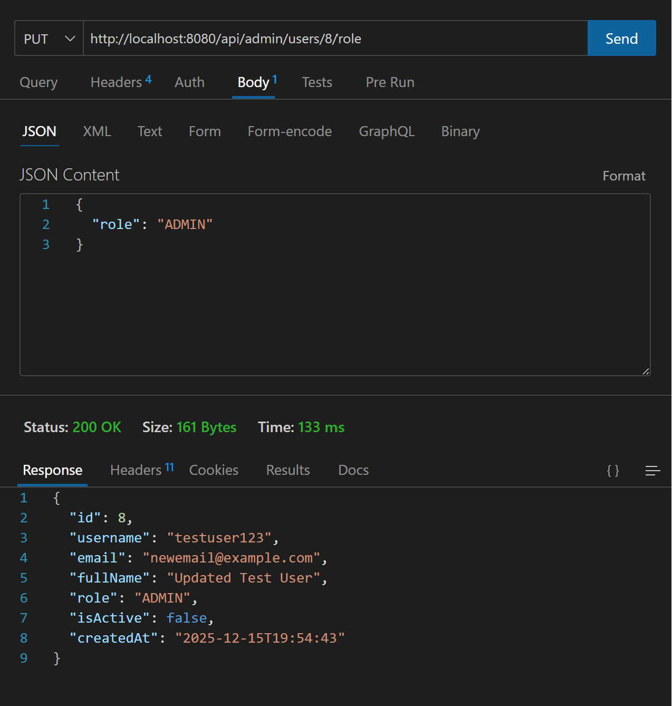
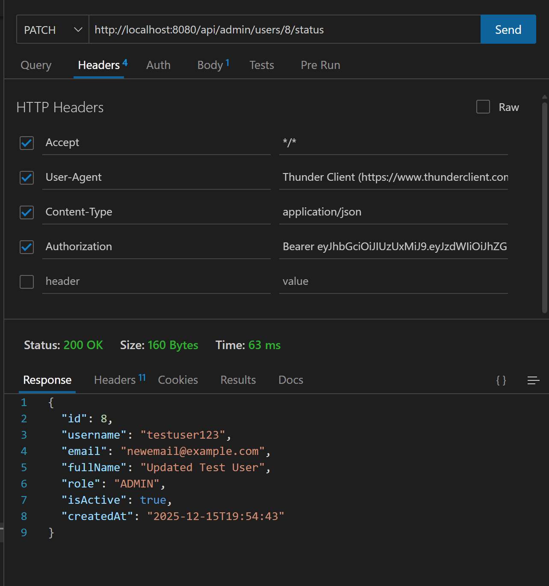
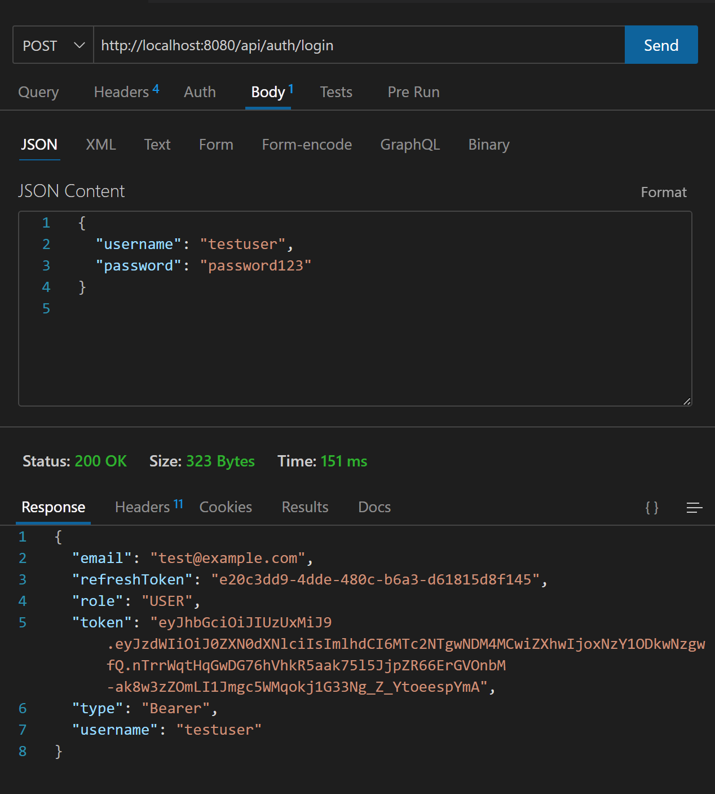

## LAB 9 EXERCISES: SPRING SECURITY & JWT AUTHENTICATION

### Nguyễn Việt Thảo - ITCSIU23058

#### EXERCISE 6: PASSWORD MANAGEMENT
- Task 6.1: Change Password Endpoint 



`ChangePasswordDTO.java` - DTO for password change requests: It contains 3 fields: current password, new password, and confirm password.
```java
public class ChangePasswordDTO {
    @NotBlank
    private String currentPassword;
    
    @NotBlank
    @Size(min = 6)
    private String newPassword;
    
    @NotBlank
    private String confirmPassword;
}
```

Endpoint in `AuthController.java`: Take the current user from the SecurityContext and call the service to change the password.
```java
@PutMapping("/change-password")
public ResponseEntity<Map<String, String>> changePassword(@Valid @RequestBody ChangePasswordDTO dto) {
    Authentication authentication = SecurityContextHolder.getContext().getAuthentication();
    String username = authentication.getName();
    userService.changePassword(username, dto);
    
    Map<String, String> response = new HashMap<>();
    response.put("message", "Password changed successfully");
    return ResponseEntity.ok(response);
}
```
Logic in `UserServiceImpl`.java: Verify the current password, check if the new password and confirm password match, and update the password.
```java
@Override
public void changePassword(String username, ChangePasswordDTO dto) {
    User user = userRepository.findByUsername(username)
            .orElseThrow(() -> new UsernameNotFoundException("User not found"));    
    if (!passwordEncoder.matches(dto.getCurrentPassword(), user.getPassword())) {
        throw new IllegalArgumentException("Current password is incorrect");
    }
    if (!dto.getNewPassword().equals(dto.getConfirmPassword())) {
        throw new IllegalArgumentException("New password and confirm password do not match");
    }
    user.setPassword(passwordEncoder.encode(dto.getNewPassword()));
    userRepository.save(user);
}
```
- Task 6.2: Forgot Password


`ForgotPasswordDTO.java` - DTO for forgot password requests: It contains the email field.
```java
public class ForgotPasswordDTO {
    @NotBlank
    @Email
    private String email;
}
```
Endpoint in `AuthController.java`: Accept the email and call the service to handle the forgot password logic.
```java
@PostMapping("/forgot-password")
public ResponseEntity<Map<String, String>> forgotPassword(@Valid @RequestBody ForgotPasswordDTO dto) {
    userService.forgotPassword(dto.getEmail());
    Map<String, String> response = new HashMap<>();
    response.put("message", "Password reset link sent to email if it exists");
    return ResponseEntity.ok(response);
}
```
Logic in `UserServiceImpl.java`: Generate a reset token, save it to the user, and simulate sending an email with the reset link.
```java
@Override
public void forgotPassword(String email) {
    Optional<User> userOpt = userRepository.findByEmail(email);
    if (userOpt.isPresent()) {
        User user = userOpt.get();
        String resetToken = UUID.randomUUID().toString();
        user.setResetToken(resetToken);
        userRepository.save(user);
        
        // Simulate sending email
        System.out.println("Password reset link: http://localhost:8080/api/auth/reset-password?token=" + resetToken);
    }
}
```
`ResetPasswordDTO.java` - DTO for reset password requests: It contains the reset token, new password, and confirm password fields.
```java
public class ResetPasswordDTO {
    @NotBlank
    private String token;   
    @NotBlank
    @Size(min = 6)
    private String newPassword;    
    @NotBlank
    private String confirmPassword;
}
```
Endpoint in `AuthController.java`: Accept the reset token and new password, and call the service to reset the password.
```java
@PostMapping("/reset-password")
public ResponseEntity<Map<String, String>> resetPassword(@Valid @RequestBody ResetPasswordDTO dto) {
    userService.resetPassword(dto);
    Map<String, String> response = new HashMap<>();
    response.put("message", "Password has been reset successfully");
    return ResponseEntity.ok(response);
}
```
Logic in `UserServiceImpl.java`: Validate the reset token, check if the new password and confirm password match, and update the password.
```java
@Override
public void resetPassword(ResetPasswordDTO dto) {
    User user = userRepository.findByResetToken(dto.getToken())
            .orElseThrow(() -> new IllegalArgumentException("Invalid reset token"));    
    if (!dto.getNewPassword().equals(dto.getConfirmPassword())) {
        throw new IllegalArgumentException("New password and confirm password do not match");
    }
    user.setPassword(passwordEncoder.encode(dto.getNewPassword()));
    user.setResetToken(null); // Clear the reset token
    userRepository.save(user);
}
``` 

#### EXERCISE 7: USER PROFILE MANAGEMENT

**Task 7.1: View Profile** - Endpoint in `UserController.java`: Get the current user's profile from the SecurityContext.
```java
@GetMapping("/profile")
public ResponseEntity<UserResponseDTO> getProfile() {
    Authentication authentication = SecurityContextHolder.getContext().getAuthentication();
    String username = authentication.getName();
    UserResponseDTO user = userService.getCurrentUser(username);
    return ResponseEntity.ok(user);
}
```

**Task 7.2: Update Profile** - `UpdateProfileDTO.java`: Contains full name and email fields.
```java
public class UpdateProfileDTO {
    @NotBlank
    private String fullName;
    
    @Email
    private String email;
}
```

Endpoint in `UserController.java`: Update the user's profile with new information.
```java
@PutMapping("/profile")
public ResponseEntity<UserResponseDTO> updateProfile(@Valid @RequestBody UpdateProfileDTO dto) {
    Authentication authentication = SecurityContextHolder.getContext().getAuthentication();
    String username = authentication.getName();
    UserResponseDTO updatedUser = userService.updateProfile(username, dto);
    return ResponseEntity.ok(updatedUser);
}
```

Logic in `UserServiceImpl.java`: Check if email is changed and not already taken, then update the user's profile.
```java
@Override
public UserResponseDTO updateProfile(String username, UpdateProfileDTO dto) {
    User user = userRepository.findByUsername(username)
            .orElseThrow(() -> new ResourceNotFoundException("User not found"));
    
    if (!user.getEmail().equals(dto.getEmail())) {
        if (userRepository.existsByEmail(dto.getEmail())) {
            throw new DuplicateResourceException("Email already exists");
        }
    }
    
    user.setFullName(dto.getFullName());
    user.setEmail(dto.getEmail());
    User updatedUser = userRepository.save(user);
    return convertToDTO(updatedUser);
}
```

**Task 7.3: Delete Account (Soft Delete)** - Endpoint in `UserController.java`: Verify password and deactivate the user account.
```java
@DeleteMapping("/account")
public ResponseEntity<Map<String, String>> deleteAccount(@RequestParam String password) {
    Authentication authentication = SecurityContextHolder.getContext().getAuthentication();
    String username = authentication.getName();
    userService.deleteAccount(username, password);
    
    Map<String, String> response = new HashMap<>();
    response.put("message", "Account deactivated successfully");
    return ResponseEntity.ok(response);
}
```

Logic in `UserServiceImpl.java`: Verify password and set isActive to false for soft delete.
```java
@Override
public void deleteAccount(String username, String password) {
    User user = userRepository.findByUsername(username)
            .orElseThrow(() -> new ResourceNotFoundException("User not found"));
    
    if (!passwordEncoder.matches(password, user.getPassword())) {
        throw new IllegalArgumentException("Password is incorrect");
    }
    
    user.setIsActive(false);
    userRepository.save(user);
}
```

#### EXERCISE 8: ADMIN ENDPOINTS

**Task 8.1: List All Users** - Endpoint in `AdminController.java`: Get all users (admin only).
```java
@GetMapping("/users")
@PreAuthorize("hasRole('ADMIN')")
public ResponseEntity<List<UserResponseDTO>> getAllUsers() {
    List<UserResponseDTO> users = userService.getAllUsers();
    return ResponseEntity.ok(users);
}
```

Logic in `UserServiceImpl.java`: Return all users from the database.
```java
@Override
public List<UserResponseDTO> getAllUsers() {
    List<User> users = userRepository.findAll();
    return users.stream()
            .map(this::convertToDTO)
            .collect(Collectors.toList());
}
```

**Task 8.2: Update User Role** - `UpdateRoleDTO.java`: Contains the role field.
```java
public class UpdateRoleDTO {
    @NotNull
    private Role role;
}
```

Endpoint in `AdminController.java`: Update a user's role by ID.
```java
@PutMapping("/users/{id}/role")
@PreAuthorize("hasRole('ADMIN')")
public ResponseEntity<UserResponseDTO> updateUserRole(
        @PathVariable Long id,
        @Valid @RequestBody UpdateRoleDTO dto) {
    UserResponseDTO updatedUser = userService.updateUserRole(id, dto);
    return ResponseEntity.ok(updatedUser);
}
```

Logic in `UserServiceImpl.java`: Find the user and update their role.
```java
@Override
public UserResponseDTO updateUserRole(Long userId, UpdateRoleDTO dto) {
    User user = userRepository.findById(userId)
            .orElseThrow(() -> new ResourceNotFoundException("User not found"));
    
    user.setRole(dto.getRole());
    User updatedUser = userRepository.save(user);
    return convertToDTO(updatedUser);
}
```

**Task 8.3: Toggle User Status** - Endpoint in `AdminController.java`: Toggle user's active status.
```java
@PatchMapping("/users/{id}/status")
@PreAuthorize("hasRole('ADMIN')")
public ResponseEntity<UserResponseDTO> toggleUserStatus(@PathVariable Long id) {
    UserResponseDTO updatedUser = userService.toggleUserStatus(id);
    return ResponseEntity.ok(updatedUser);
}
```

Logic in `UserServiceImpl.java`: Toggle the user's isActive status.
```java
@Override
public UserResponseDTO toggleUserStatus(Long userId) {
    User user = userRepository.findById(userId)
            .orElseThrow(() -> new ResourceNotFoundException("User not found"));
    
    user.setIsActive(!user.getIsActive());
    User updatedUser = userRepository.save(user);
    return convertToDTO(updatedUser);
}
```

#### EXERCISE 9: REFRESH TOKEN

**Task 9.1: Create Refresh Token Entity** - `RefreshToken.java`: Entity to store refresh tokens.
```java
@Entity
@Table(name = "refresh_tokens")
public class RefreshToken {
    @Id
    @GeneratedValue(strategy = GenerationType.IDENTITY)
    private Long id;
    
    @ManyToOne
    @JoinColumn(name = "user_id")
    private User user;
    
    @Column(unique = true, nullable = false)
    private String token;
    
    @Column(nullable = false)
    private LocalDateTime expiryDate;
    
    public boolean isExpired() {
        return LocalDateTime.now().isAfter(this.expiryDate);
    }
}
```

**Task 9.2: Generate Refresh Token** - Updated login in `UserServiceImpl.java`: Generate both access and refresh tokens.
```java
@Override
public LoginResponseDTO login(LoginRequestDTO loginRequest) {
    Authentication authentication = authenticationManager.authenticate(
        new UsernamePasswordAuthenticationToken(
            loginRequest.getUsername(),
            loginRequest.getPassword()
        )
    );
    
    String token = tokenProvider.generateToken(authentication);
    User user = userRepository.findByUsername(loginRequest.getUsername())
            .orElseThrow(() -> new ResourceNotFoundException("User not found"));
    
    // Generate refresh token
    RefreshToken refreshToken = createRefreshToken(user.getUsername());
    
    return new LoginResponseDTO(
        token,
        user.getUsername(),
        user.getEmail(),
        user.getRole().name(),
        refreshToken.getToken()
    );
}
```

Logic to create refresh token:
```java
@Override
public RefreshToken createRefreshToken(String username) {
    User user = userRepository.findByUsername(username)
            .orElseThrow(() -> new ResourceNotFoundException("User not found"));
    
    // Delete existing refresh token
    refreshTokenRepository.findByUser(user).ifPresent(refreshTokenRepository::delete);
    
    RefreshToken refreshToken = new RefreshToken();
    refreshToken.setUser(user);
    refreshToken.setToken(UUID.randomUUID().toString());
    refreshToken.setExpiryDate(LocalDateTime.now().plusDays(7)); // 7 days expiry
    
    return refreshTokenRepository.save(refreshToken);
}
```

**Task 9.3: Refresh Access Token** - `RefreshTokenDTO.java`: Contains the refresh token field.
```java
public class RefreshTokenDTO {
    @NotBlank
    private String refreshToken;
}
```

Endpoint in `AuthController.java`: Refresh the access token using a refresh token.
```java
@PostMapping("/refresh")
public ResponseEntity<LoginResponseDTO> refreshToken(@Valid @RequestBody RefreshTokenDTO dto) {
    LoginResponseDTO response = userService.refreshAccessToken(dto.getRefreshToken());
    return ResponseEntity.ok(response);
}
```

Logic in `UserServiceImpl.java`: Verify the refresh token and generate a new access token.
```java
@Override
public LoginResponseDTO refreshAccessToken(String refreshTokenStr) {
    RefreshToken refreshToken = refreshTokenRepository.findByToken(refreshTokenStr)
            .orElseThrow(() -> new ResourceNotFoundException("Refresh token not found"));
    
    if (refreshToken.isExpired()) {
        refreshTokenRepository.delete(refreshToken);
        throw new IllegalArgumentException("Refresh token has expired");
    }
    
    User user = refreshToken.getUser();
    Authentication authentication = new UsernamePasswordAuthenticationToken(
            user.getUsername(), null, null);
    String newAccessToken = tokenProvider.generateToken(authentication);
    
    // Generate new refresh token
    RefreshToken newRefreshToken = createRefreshToken(user.getUsername());
    
    return new LoginResponseDTO(
            newAccessToken,
            user.getUsername(),
            user.getEmail(),
            user.getRole().name(),
            newRefreshToken.getToken()
    );
}
```

---
